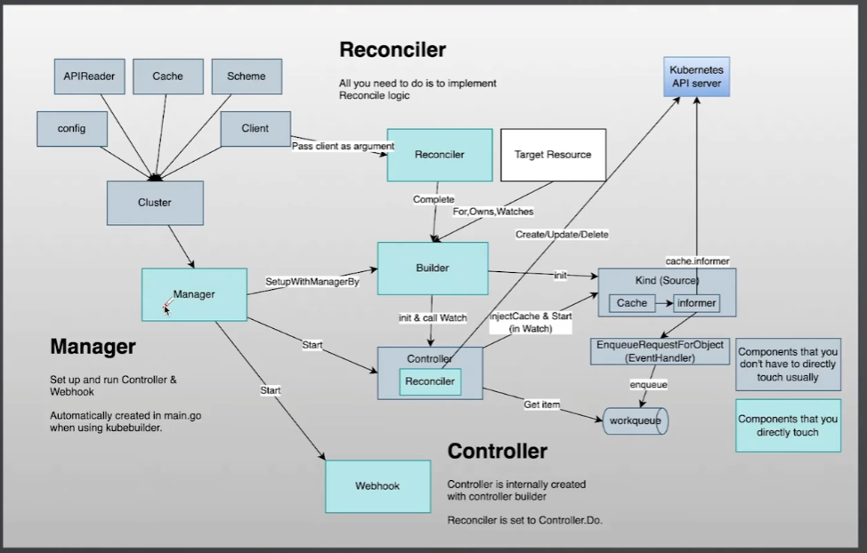
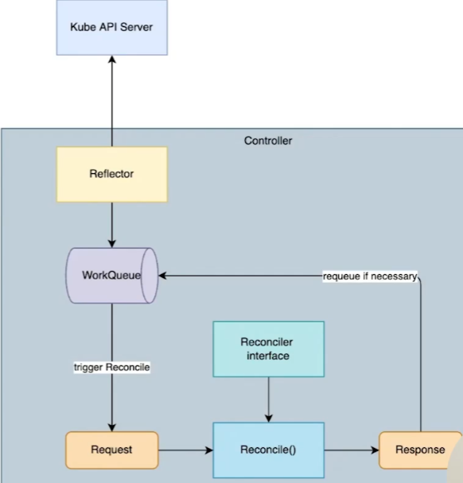

#### Kubebuilder 架构
- Manager: 初始化 Controller
- Controller: 具备 Cache 、队列和失败重试能力
- Reconciler: 只需实现这部分业务逻辑
- Client: 不能直接使用
- Cache: 不能直接使用
- Webhook: 编写AdmissionWebHook 使用


#### Reconcile 架构
- 触发 Reconcile 的过程实际上是从是从工作队列获取元素的过程
- 根据 Reconcile 的业务逻辑执行结果， 分几种情况
- 》执行成功，无需重试
- 》执行错误，需要重试
- 》执行成功，因其他原因需要重试
- 》其他原因需要等待一段时间后重试


#### Reconcile 重试
```
func (r *MyReconciler) Reconcile(ctx context.Context, req ctrl.Request) (ctrl.esult, error) {
    ...
    err := someFunc()
    if err != nil {
        return Result{}, err // 返回错误以出发重试
    }
}
```
- 成功。 无需重试： return ctrl.Result{},nil
- 失败， 需要重试： return ctrl.Result{},err
- 成功， 其他原因需要重试： return ctrl.Result{Requeue:true},nil
- 其他原因需要等待一段事件后重试： return ctrl.Result{RequeueAfter: 5 * time.Second},nil

#### 初始化
```
## kind version 0.26.0
## go version go1.22.10 linux/amd64
## k8s version v1.32.0
## KubeBuilderVersion: 4.3.1


mkdir application
go mod init github.com/lostar01/application

#kubebuilder init
kubebuilder init --domain=aiops.com

#kubebuilder create api
kubebuilder create api --group application --version v1 --kind Application
INFO Create Resource [y/n]                        
y
INFO Create Controller [y/n]                      
y
```

#### 定义type 字段
```
type ApplicationSpec struct {
	// INSERT ADDITIONAL SPEC FIELDS - desired state of cluster
	// Important: Run "make" to regenerate code after modifying this file

	Deployment ApplicationDeployment   `json:"deployment"`
	Service    corev1.ServiceSpec      `json:"service"`
	Ingress    networingv1.IngressSpec `json:"ingress"`
}

type ApplicationDeployment struct {
	Image    string `json:"image"`
	Replicas int32  `json:"replicas"`
	port     int32  `json:"port"`
}

// ApplicationStatus defines the observed state of Application.
type ApplicationStatus struct {
	// INSERT ADDITIONAL STATUS FIELD - define observed state of cluster
	// Important: Run "make" to regenerate code after modifying this file

	AvailableReplicas int32 `json:"availableReplicas"`
}
```

#### make manifests
```
#创建crd
make manifests
```